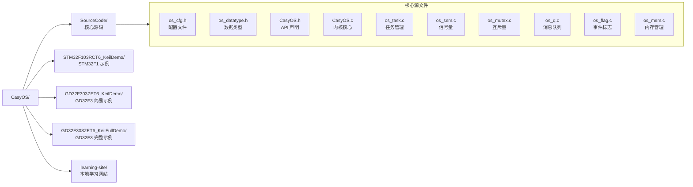
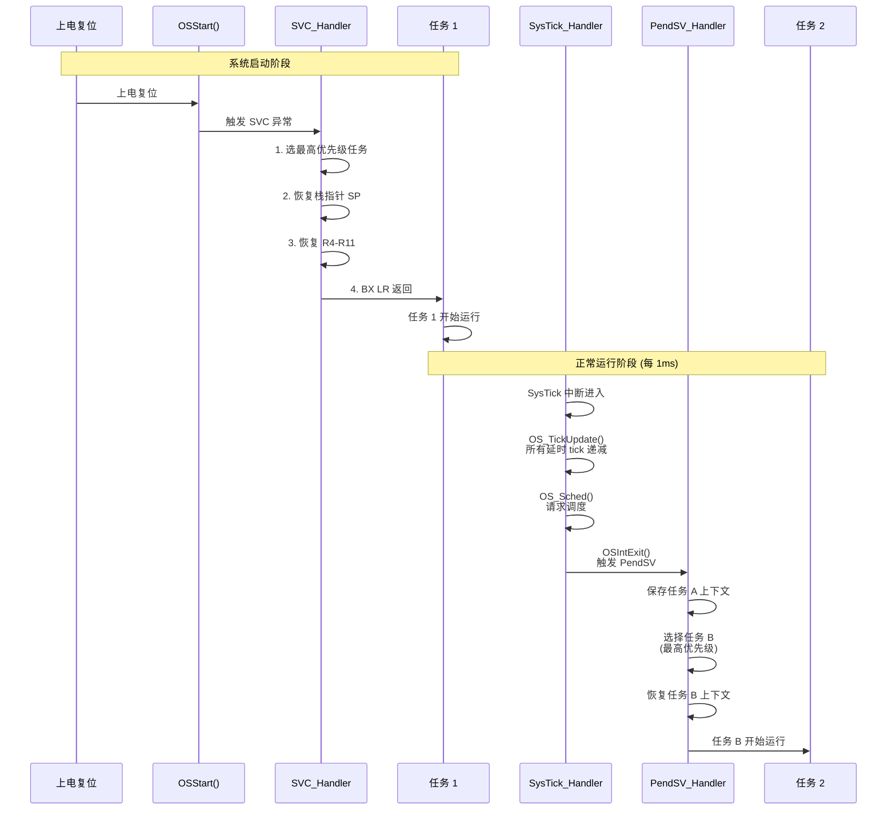
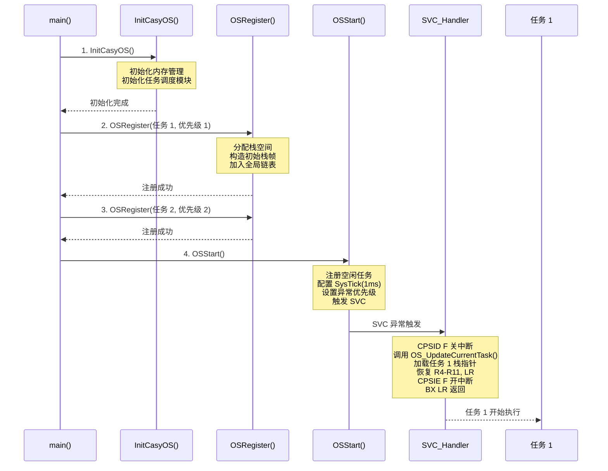
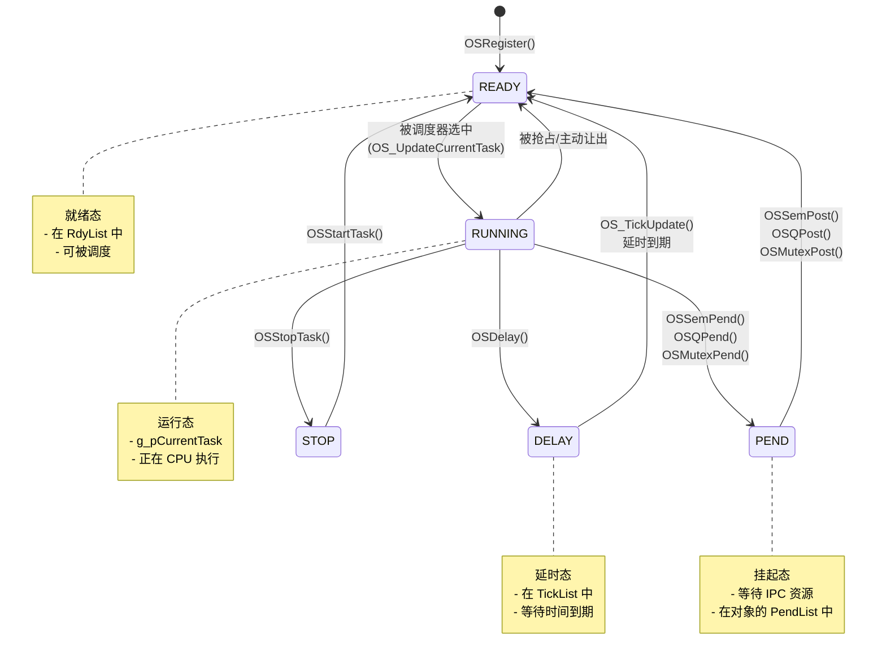
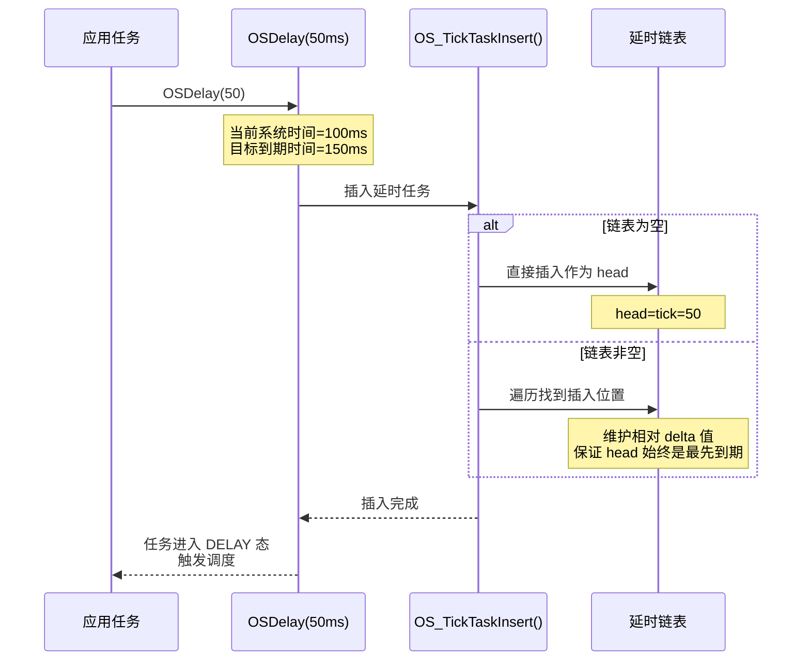
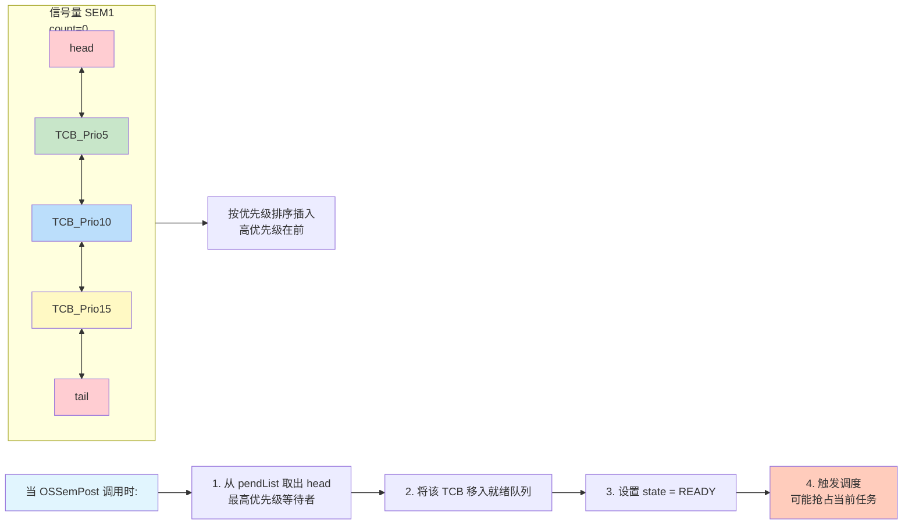
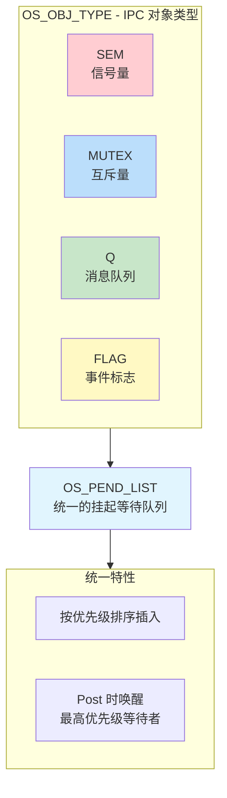
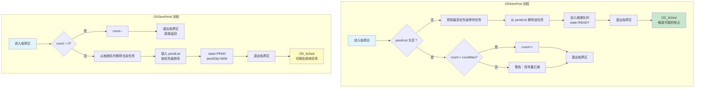

# CasyOS 学习指南

> 一个面向 Cortex-M3/M4 的轻量级教学型 RTOS，约 2600 行代码，适合学习 RTOS 内核原理
> 
> 💡 **提示**: 本文档使用 Mermaid 图表，建议在 GitHub 或支持 Mermaid 的 Markdown 编辑器中查看以获得最佳体验。

---

## 📚 目录

1. [系统架构总览](#1-系统架构总览)
2. [核心机制详解](#2-核心机制详解)
3. [任务管理子系统](#3-任务管理子系统)
4. [IPC 通信机制](#4-ipc-通信机制)
5. [内存管理](#5-内存管理)
6. [移植指南](#6-移植指南)
7. [实战示例](#7-实战示例)
8. [扩展方向](#8-扩展方向)

---

## 1. 系统架构总览

### 1.1 整体架构图

```mermaid
graph TB
    subgraph AppLayer[用户应用层]
        T1[任务 1]
        T2[任务 2]
        T3[任务 3]
        TIdle[空闲任务]
    end

    subgraph KernelLayer[CasyOS 内核层]
        subgraph Scheduler[调度器]
            BitMap[优先级位图<br/>BitMap[32]]
            RdyList[就绪队列组<br/>RdyList[32]]
            TickList[延时链表<br/>TickList]
        end
        
        subgraph Exception[异常驱动切换机制]
            SysTick[SysTick<br/>节拍时钟 1ms]
            SVC[SVC<br/>启动首个任务]
            PendSV[PendSV<br/>任务切换上下文]
        end
        
        subgraph IPC[IPC 通信模块]
            SEM[信号量 SEM]
            MUTEX[互斥量 MUTEX]
            MSGQ[消息队列 MSG Q]
            FLAG[事件标志 FLAG]
        end
        
        subgraph Memory[内存管理模块]
            MemPool[OSMalloc / OSFree<br/>内存池管理]
        end
    end

    subgraph Hardware[Cortex-M3/M4 硬件层]
        NVIC[NVIC<br/>中断控制器]
        ST[SysTick<br/>定时器]
        FPU[FPU<br/>浮点单元可选]
    end

    AppLayer --> KernelLayer
    KernelLayer --> Hardware
    T1 & T2 & T3 & TIdle --> Scheduler
    Scheduler --> Exception
    Exception --> Hardware
```

### 1.2 文件结构图



### 1.3 代码规模统计

| 模块 | 文件名 | 行数 | 功能说明 |
|------|--------|------|----------|
| 内核核心 | CasyOS.c | 453 | 异常处理、任务切换、系统启动 |
| 任务管理 | os_task.c | 851 | 就绪队列、位图、延时链表、挂起队列 |
| 信号量 | os_sem.c | 223 | 二值/计数信号量 |
| 互斥量 | os_mutex.c | 254 | 递归互斥锁 |
| 消息队列 | os_q.c | 291 | 环形缓冲区消息队列 |
| 事件标志 | os_flag.c | 265 | 32 位事件标志组 |
| 内存管理 | os_mem.c | 299 | 动态内存池管理 |
| 头文件 | CasyOS.h | 533 | API 声明和数据结构 |
| **总计** | - | **~3267** | 精简学习型 RTOS |

---

## 2. 核心机制详解

### 2.1 三大异常机制

CasyOS 依赖 Cortex-M 的三个关键异常实现任务调度：

```
┌──────────────────────────────────────────────────────────────┐
│                     异常向量表                                │
│                                                              │
│  地址偏移    异常名称        用途                            │
│  ─────────────────────────────────────────────────          │
│  0x00000008  NMI            不可屏蔽中断                     │
│  0x0000000C  HardFault      硬件错误                         │
│  0x00000010  MemManage      内存管理错误                     │
│  0x00000014  BusFault       总线错误                         │
│  0x00000018  UsageFault     用法错误                         │
│  0x0000001C  Reserved       保留                             │
│  ...         ...            ...                              │
│  0x00000034  SVCall         ★ SVC - 启动第一个任务           │
│  0x00000038  DebugMon       调试监视                         │
│  0x0000003C  Reserved       保留                             │
│  0x00000040  PendSV         ★ PendSV - 任务上下文切换        │
│  0x00000044  SysTick        ★ SysTick - 系统节拍时钟         │
└──────────────────────────────────────────────────────────────┘
```

#### 2.1.1 三异常协作时序图



### 2.2 系统启动流程



### 2.3 上下文切换详细流程

#### 2.3.1 硬件自动保存部分

当异常发生时，Cortex-M 硬件自动将以下寄存器压入栈中：

```
高地址
┌─────────────────┐
│     xPSR        │ ← 程序状态寄存器
├─────────────────┤
│       PC        │ ← 程序计数器
├─────────────────┤
│       LR        │ ← 链接寄存器
├─────────────────┤
│      R12        │
├─────────────────┤
│       R3        │
├─────────────────┤
│       R2        │
├─────────────────┤
│       R1        │
├─────────────────┤
│       R0        │ ← 栈顶指针 SP 指向这里
└─────────────────┘
低地址
```

#### 2.3.2 软件手动保存部分 (PendSV_Handler)

```assembly
PendSV_Handler:
    CPSID F              ; 关中断
    PUSH {LR}            ; 保存 LR
    VPUSH {S16-S31}      ; 保存 FPU 寄存器 (可选)
    PUSH {R4-R11}        ; 保存 R4-R11
    
    ; 保存当前 SP 到 TCB
    LDR R4, =g_pCurrentTask
    LDR R5, [R4]
    STR SP, [R5]         ; SP → TCB->stackTop
    
    ; 选择下一个任务
    BL OS_UpdateCurrentTask
    
    ; 恢复下一个任务 SP
    LDR R4, =g_pCurrentTask
    LDR R5, [R4]
    LDR SP, [R5]         ; TCB->stackTop → SP
    
    ; 恢复寄存器
    POP {R4-R11}
    VPOP {S16-S31}
    POP {LR}
    
    CPSIE F              ; 开中断
    BX LR                ; 异常返回
```

#### 2.3.3 完整栈帧结构

```
任务栈内存布局 (从高地址到低地址):

┌─────────────────────────────────────┐
│          空闲栈空间                  │
│              ...                    │
│                                     │
├─────────────────────────────────────┤
│         软件保存帧                   │
│         (PendSV 保存)                │
│              LR                     │ ← SP 初始位置
│         S16-S31 (可选)              │
│              R11                    │
│              R10                    │
│              ...                    │
│              R4                     │
├─────────────────────────────────────┤
│         硬件保存帧                   │
│         (异常自动保存)               │
│              R0                     │
│              R1                     │
│              R2                     │
│              R3                     │
│              R12                    │
│              LR                     │
│              PC                     │
│              xPSR                   │
└─────────────────────────────────────┘
```

### 2.4 调度策略与时序

```
┌─────────────────────────────────────────────────────────────────┐
│                    固定优先级抢占式调度                          │
│                                                                 │
│  优先级数值越小，优先级越高 (0 为最高优先级)                       │
│                                                                 │
│  时刻    任务 1(Prio=1)    任务 2(Prio=2)    任务 3(Prio=3)    │
│  ───────────────────────────────────────────────────────────   │
│  t0      ████████████                                          │
│  t1      ████████████                                          │
│  t2      ████████████      ███                                 │
│  t3      ███               ████████████                        │
│  t4                          ████████████                      │
│  t5                          ████████          ████            │
│  t6      ██████████████████████████            ████            │
│  t7      ██████████████████████████            ████            │
│  t8      ██████████████████████████            ████            │
│                                                                 │
│  图例：                                                         │
│  ████ = 运行态 (RUNNING)                                        │
│  ···· = 就绪态 (READY)                                          │
│  ---- = 阻塞态 (PEND/DELAY)                                     │
└─────────────────────────────────────────────────────────────────┘
```

#### 调度触发时机

```
┌───────────────────────────────────────────────────────────────┐
│                    调度触发来源                                │
│                                                               │
│  ┌─────────────────────────────────────────────────────────┐ │
│  │ 1. SysTick 节拍中断                                      │ │
│  │    - 延时任务到期                                         │ │
│  │    - 时间片轮转 (未来扩展)                                 │ │
│  └─────────────────────────────────────────────────────────┘ │
│                                                               │
│  ┌─────────────────────────────────────────────────────────┐ │
│  │ 2. IPC Post 操作                                         │ │
│  │    - OSSemPost() 唤醒高优先级等待任务                     │ │
│  │    - OSQPost() 发送消息给等待任务                         │ │
│  │    - OSMutexPost() 释放互斥量                            │ │
│  │    - OSFlagPost() 设置匹配的标志位                        │ │
│  └─────────────────────────────────────────────────────────┘ │
│                                                               │
│  ┌─────────────────────────────────────────────────────────┐ │
│  │ 3. 任务主动阻塞                                          │ │
│  │    - OSDelay() 主动延时                                  │ │
│  │    - OSSemPend() 等待信号量                              │ │
│  │    - OSQPend() 等待消息                                  │ │
│  └─────────────────────────────────────────────────────────┘ │
│                                                               │
│  ┌─────────────────────────────────────────────────────────┐ │
│  │ 4. 中断退出时                                            │ │
│  │    - OSIntExit() 检查 g_OSSchedFlag                      │ │
│  │    - 若需要调度则触发 PendSV                              │ │
│  └─────────────────────────────────────────────────────────┘ │
└───────────────────────────────────────────────────────────────┘
```

---

## 3. 任务管理子系统

### 3.1 任务控制块 (TCB) 结构

```c
typedef struct OS_TASK_HANDLE {
    // === 栈信息 (必须位于结构体起始位置) ===
    u32* stackTop;           // 当前栈顶指针
    u32* stackBase;          // 栈底地址
    u32  stackSize;          // 栈大小 (单位：u32)
    
    // === 任务基本信息 ===
    void* func;              // 任务入口函数
    char* taskName;          // 任务名称
    u32 priority;            // 优先级 (0 为最高)
    u64 tick;                // 延时计数 (ms)
    OS_TASK_STAT state;      // 任务状态
    
    // === 链表指针 ===
    void* pendObj;           // 当前等待的对象
    OS_TASK_HANDLE* nextPtr; // 全局任务链表
    OS_TASK_HANDLE* rdyNextPtr;  // 就绪链表后向
    OS_TASK_HANDLE* rdyPrevPtr;  // 就绪链表前向
    OS_TASK_HANDLE* tickNextPtr; // 延时链表后向
    OS_TASK_HANDLE* tickPrevPtr; // 延时链表前向
    OS_TASK_HANDLE* pendNextPtr; // 挂起链表后向
    OS_TASK_HANDLE* pendPrevPtr; // 挂起链表前向
    
    // === 可裁剪的内建对象 ===
    #if OS_CFG_SEM_EN
        OS_SEM sem;          // 内建信号量
    #endif
    #if OS_CFG_Q_EN
        OS_Q msgQueue;       // 内建消息队列
        u32 msgTemp;         // 临时消息缓存
    #endif
    #if OS_CFG_FLAG_EN
        u32 flagsMaskPendOn; // 等待的标志位掩码
        OS_FLAG_PEDN_OPT flagsPendOpt; // 等待条件
    #endif
} OS_TASK_HANDLE;
```

### 3.2 任务状态转换图



### 3.3 就绪队列与优先级位图

#### 3.3.1 数据结构设计

```
就绪队列组 (每个优先级一个双向链表):

s_OSRdyLists[32]:
┌─────────────────────────────────────────────────────────────┐
│ prio=0  ▶  head ↔ [TCB1] ↔ [TCB2] ↔ tail                   │
│ prio=1  ▶  head ↔ [TCB3] ↔ tail                            │
│ prio=2  ▶  head ↔ tail (空)                                │
│ ...                                                         │
│ prio=31 ▶  head ↔ [TCB4] ↔ [TCB5] ↔ [TCB6] ↔ tail          │
└─────────────────────────────────────────────────────────────┘

优先级位图 (快速定位最高优先级):

s_OSPrioBitMap (32 位):
┌─────────────────────────────────────────────────────────────┐
│ bit31  bit30  ...  bit2  bit1  bit0                         │
│   1      0    ...   0     1     1                           │
│   ↑                    ↑     ↑                              │
│ prio=0               prio=29 prio=31                        │
│ (最高优先级)                                                │
└─────────────────────────────────────────────────────────────┘

使用 __builtin_clz() 快速找到最高优先级:
  clz(BitMap) = 前导零个数
  最高优先级 = 31 - clz(BitMap)
  
  例：BitMap = 0b1000...0011 (bit31=1, bit1=1, bit0=1)
      clz = 0
      最高优先级 = 31 - 0 = 31 → 实际对应 prio=0 (反转映射)
```

#### 3.3.2 O(1) 调度算法流程

```mermaid
flowchart TD
    A[进入临界区] --> B{位图是否为 0？}
    B -- 是 --> C[无就绪任务<br/>错误状态]
    B -- 否 --> D[__builtin_clz<br/>位图]
    D --> E[计算最高优先级<br/>prio = 31 - clz]
    E --> F[从 RdyList[prio]<br/>取出头结点]
    F --> G[更新 g_pCurrentTask]
    G --> H[退出临界区]
    
    style A fill:#e1f5fe
    style H fill:#c8e6c9
    style C fill:#ffcdd2
    style D fill:#fff9c4
    style F fill:#f3e5f5
```

### 3.4 延时链表 (增量链表)

#### 3.4.1 增量链表原理

```
传统链表 vs 增量链表:

【传统链表】每次 SysTick 遍历所有节点:
┌─────────┐   ┌─────────┐   ┌─────────┐   ┌─────────┐
│ Task A  │──▶│ Task B  │──▶│ Task C  │──▶│ Task D  │
│tick=100 │   │tick=50  │   │tick=20  │   │tick=5   │
└─────────┘   └─────────┘   └─────────┘   └─────────┘
  每次 tick--   每次 tick--   每次 tick--   每次 tick--
  O(n) 复杂度 ❌

【增量链表】只减头节点，到期移除:
┌─────────┐   ┌─────────┐   ┌─────────┐   ┌─────────┐
│ Task A  │──▶│ Task B  │──▶│ Task C  │──▶│ Task D  │
│delta=5  │   │delta=15 │   │delta=30 │   │delta=45 │
│(5ms 后)  │   │(再 15ms) │   │(再 30ms) │   │(再 45ms) │
└─────────┘   └─────────┘   └─────────┘   └─────────┘
     │
     ▼
  每次只减 head->tick
  O(1) 复杂度 ✅

插入新任务 (tick=25ms):
原链表:  [5] ──▶ [15] ──▶ [30] ──▶ [45]
                    ↑
               插入位置

新链表:  [5] ──▶ [10] ──▶ [25] ──▶ [30] ──▶ [45]
                 ▲      ▲
           原 15-5=10  新任务相对 10 的差值=25
```

#### 3.4.2 延时插入时序图



### 3.5 挂起队列 (Pend List)



---

## 4. IPC 通信机制

### 4.1 IPC 总体架构



### 4.2 信号量 (Semaphore)

#### 4.2.1 数据结构

```c
typedef struct OS_SEM {
    OS_OBJ_TYPE objType;    // 对象类型 (=OS_OBJ_TYPE_SEM)
    OS_PEND_LIST pendList;  // 等待队列
    u32 count;              // 当前可用资源数
    u32 countMax;           // 最大计数值 (防溢出)
} OS_SEM;
```

#### 4.2.2 工作流程图



#### 4.2.3 信号量时序图

```mermaid
sequenceDiagram
    participant TaskH as 高优先级任务
    participant Sem as 信号量 SEM
    participant TaskL as 低优先级任务
    
    Note over TaskH,Sem: 初始状态：count=0
    Note over TaskL,Sem: 两个任务都等待信号量
    
    TaskH->>Sem: OSSemPend()
    Note over Sem: count=0, 挂起 TaskH<br/>pendList: [TaskH]
    Note over TaskH: 进入 PEND 态
    
    TaskL->>Sem: OSSemPend()
    Note over Sem: count=0, 挂起 TaskL<br/>pendList: [TaskH, TaskL]
    Note over TaskL: 进入 PEND 态
    
    Note over TaskH,Sem: 此时无任务运行 (或空闲任务运行)
    
    interrupt ISR 中断发生
        Note over Sem: OSSemPost() 从中断调用
        Sem->>TaskH: 唤醒最高优先级等待者
        Note over Sem: count 仍为 0<br/>pendList: [TaskL]
        Note over TaskH: 进入 READY 态
    end
    
    Note over TaskH: 任务切换后 TaskH 运行
    TaskH->>Sem: OSSemPost()
    Note over Sem: pendList 非空，唤醒 TaskL
    Note over TaskL: 进入 READY 态
```

### 4.3 互斥量 (Mutex)

#### 4.3.1 支持递归锁的互斥量

```c
typedef struct OS_MUTEX {
    OS_OBJ_TYPE objType;    // 对象类型
    OS_PEND_LIST pendList;  // 等待队列
    u8* name;               // 互斥量名称
    OS_TASK_HANDLE* ownerTcb; // 当前持有者
    u32 lockCnt;            // 递归加锁计数
} OS_MUTEX;
```

#### 4.3.2 递归锁机制

```
┌───────────────────────────────────────────────────────────────┐
│                    递归锁场景示例                              │
│                                                               │
│  任务 A (Prio=1):                                            │
│  ┌─────────────────────────────────────────────────────────┐ │
│  │ void TaskA(void)                                        │ │
│  │ {                                                       │ │
│  │     OSMutexPend(&mutex);  // 第一次加锁                  │ │
│  │     // ownerTcb = TaskA, lockCnt = 1                    │ │
│  │                                                         │ │
│  │     SomeFunction();       // 调用其他函数               │ │
│  │                                                         │ │
│  │     OSMutexPend(&mutex);  // ★ 递归加锁 (同一任务)       │ │
│  │     // ownerTcb = TaskA, lockCnt = 2 (不阻塞!)          │ │
│  │                                                         │ │
│  │     OSMutexPost(&mutex);  // lockCnt = 1                │ │
│  │     OSMutexPost(&mutex);  // lockCnt = 0, 真正释放      │ │
│  │ }                                                       │ │
│  └─────────────────────────────────────────────────────────┘ │
│                                                               │
│  任务 B (Prio=2) 尝试获取:                                    │
│  ┌─────────────────────────────────────────────────────────┐ │
│  │ void TaskB(void)                                        │ │
│  │ {                                                       │ │
│  │     OSMutexPend(&mutex);  // 被阻塞，进入 pendList       │ │
│  │     // 等待 TaskA 完全释放                               │ │
│  │ }                                                       │ │
│  └─────────────────────────────────────────────────────────┘ │
└───────────────────────────────────────────────────────────────┘
```

### 4.4 消息队列 (Message Queue)

#### 4.4.1 环形缓冲区设计

```c
typedef struct OS_Q {
    OS_OBJ_TYPE objType;    // 对象类型
    u32* msgBase;           // 动态分配的缓冲区
    u32 countMax;           // 最大容量 (元素个数)
    u32 count;              // 当前消息数量
    u32 inIdx;              // 写索引
    u32 outIdx;             // 读索引
} OS_Q;
```

#### 4.4.2 环形队列工作原理

```
消息队列内存布局 (countMax=8):

msgBase:
┌─────┬─────┬─────┬─────┬─────┬─────┬─────┬─────┐
│  0  │  1  │  2  │  3  │  4  │  5  │  6  │  7  │
└─────┴─────┴─────┴─────┴─────┴─────┴─────┴─────┘
              ↑                       ↑
            outIdx                  inIdx
            (读)                     (写)
            
状态：count = 3 (索引 2,3,4 有数据)

入队操作 OSQPost(msg):
  msgBase[inIdx] = msg;
  inIdx = (inIdx + 1) % countMax;
  count++;

出队操作 OSQPend():
  msg = msgBase[outIdx];
  outIdx = (outIdx + 1) % countMax;
  count--;

┌───────────────────────────────────────────────────────────────┐
│                    消息投递优化                                │
│                                                               │
│  场景：任务正在等待消息 (pendList 非空)                         │
│                                                               │
│  OSQPost() 优化路径:                                          │
│  1. 检测到目标任务在等待该队列                                 │
│  2. 直接将消息写入 TCB->msgTemp                               │
│  3. 唤醒任务 (不经过环形缓冲)                                  │
│  4. 减少一次内存拷贝，降低延迟                                 │
│                                                               │
│  否则走标准环形缓冲路径                                       │
└───────────────────────────────────────────────────────────────┘
```

### 4.5 事件标志组 (Event Flag Group)

#### 4.5.1 等待模式

```c
// 等待模式枚举
typedef enum OS_FLAG_PEDN_OPT {
    OS_FLAG_WAIT_NONE,      // 不等待 (立即返回)
    OS_FLAG_WAIT_SET_ALL,   // 等待 mask 指定的所有位都为 1
    OS_FLAG_WAIT_SET_ANY,   // 等待 mask 指定的任意一位为 1
    OS_FLAG_WAIT_CLR_ALL,   // 等待 mask 指定的所有位都为 0
    OS_FLAG_WAIT_CLR_ANY    // 等待 mask 指定的任意一位为 0
} OS_FLAG_PEDN_OPT;
```

#### 4.5.2 标志组匹配逻辑

```
┌───────────────────────────────────────────────────────────────┐
│                    事件标志匹配逻辑                            │
│                                                               │
│  标志寄存器 flags:  0b1101_0101  (bit0,2,4,5,6=1)            │
│                                                               │
│  等待任务 TCB1:                                               │
│    flagsMaskPendOn = 0b0000_0101  (等待 bit0 和 bit2)          │
│    flagsPendOpt    = OS_FLAG_WAIT_SET_ALL                     │
│    匹配结果：✓ 匹配 (bit0=1 且 bit2=1)                         │
│                                                               │
│  等待任务 TCB2:                                               │
│    flagsMaskPendOn = 0b0000_0011  (等待 bit0 和 bit1)          │
│    flagsPendOpt    = OS_FLAG_WAIT_SET_ALL                     │
│    匹配结果：✗ 不匹配 (bit1=0)                                │
│                                                               │
│  等待任务 TCB3:                                               │
│    flagsMaskPendOn = 0b0000_0010  (等待 bit1)                  │
│    flagsPendOpt    = OS_FLAG_WAIT_SET_ANY                     │
│    匹配结果：✗ 不匹配 (bit1=0)                                │
│                                                               │
│  等待任务 TCB4:                                               │
│    flagsMaskPendOn = 0b0010_0000  (等待 bit5)                  │
│    flagsPendOpt    = OS_FLAG_WAIT_CLR_ANY                     │
│    匹配结果：✗ 不匹配 (bit5=1, 要求为 0)                       │
│                                                               │
│  OSFlagPost(flags=0b0000_0010, opt=SET):                     │
│    新 flags = 0b1101_0111                                     │
│    重新检查等待队列:                                          │
│    - TCB2 现在匹配! (bit0=1 且 bit1=1) → 唤醒                  │
│    - TCB3 现在匹配! (bit1=1) → 如果优先级更高也唤醒            │
└───────────────────────────────────────────────────────────────┘
```

---

## 5. 内存管理

### 5.1 内存池结构

```c
typedef struct OS_MEM_NODE {
    u32 memUsedSize;        // bit31: 占用标志，bit30-0: 大小
    struct OS_MEM_NODE* memNextNode;  // 下一块内存节点
} OS_MEM_NODE;
```

### 5.2 内存块格式

```
内存池布局:

memoryBase                                                      memoryEnd
   │                                                               │
   ▼                                                               ▼
┌─────────────────┬─────────────────┬─────────────────┬───────────┐
│   Node Header   │   User Data     │   Node Header   │    ...    │
│  (8 字节)        │  (可变大小)      │  (8 字节)        │           │
└─────────────────┴─────────────────┴─────────────────┴───────────┘
   ▲               ▲                 ▲
   │               │                 │
memUsedSize    用户可用空间       下一块头部
bit31=0(空闲)
bit30-0=大小
```

### 5.3 分配算法

```
首次适配 (First Fit) 算法:

┌───────────────────────────────────────────────────────────────┐
│  请求分配 50 字节                                              │
│                                                               │
│  当前内存池状态:                                              │
│  ┌────────┬────────┬────────┬────────┬────────┐             │
│  │ 已用   │ 空闲   │ 已用   │ 空闲   │ 已用   │             │
│  │ 30B    │ 100B   │ 40B    │ 60B    │ 20B    │             │
│  └────────┴────────┴────────┴────────┴────────┘             │
│           ▲                    ▲                             │
│           │                    │                             │
│      首次适配 ✓          也满足但不会选                       │
│                                                               │
│  分配后:                                                      │
│  ┌────────┬────────┬────────┬────────┬────────┐             │
│  │ 已用   │ 已用   │ 已用   │ 空闲   │ 已用   │             │
│  │ 30B    │ 50B    │ 40B    │ 60B    │ 20B    │             │
│  │        │剩余 50B│        │        │        │             │
│  └────────┴────────┴────────┴────────┴────────┘             │
└───────────────────────────────────────────────────────────────┘
```

---

## 6. 移植指南

### 6.1 移植步骤总览

```
┌───────────────────────────────────────────────────────────────┐
│                    CasyOS 移植步骤                            │
│                                                               │
│  Step 1: 修改 os_cfg.h                                        │
│  ┌─────────────────────────────────────────────────────────┐ │
│  │ - 替换芯片外设头文件 (#include "gd32f30x_conf.h")        │ │
│  │ - 替换 printf 实现头文件                                  │ │
│  │ - 配置 OS_CFG_FPU_EN (芯片是否有 FPU)                    │ │
│  │ - 配置 OS_CFG_PRIO_MAX (最大优先级数)                    │ │
│  └─────────────────────────────────────────────────────────┘ │
│                                                               │
│  Step 2: 配置 SysTick                                         │
│  ┌─────────────────────────────────────────────────────────┐ │
│  │ - 在 OSStart() 中配置 SysTick 产生 1ms 中断                 │ │
│  │ - 计算公式：reload = SystemCoreClock / 1000 - 1         │ │
│  │ - 使能 SysTick 中断                                      │ │
│  └─────────────────────────────────────────────────────────┘ │
│                                                               │
│  Step 3: 配置中断优先级                                        │
│  ┌─────────────────────────────────────────────────────────┐ │
│  │ - PendSV 设置为最低优先级                                │ │
│  │ - SysTick 设置为较高优先级 (但不能高于临界区屏蔽级别)     │ │
│  │ - 确保中断优先级分组正确                                  │ │
│  └─────────────────────────────────────────────────────────┘ │
│                                                               │
│  Step 4: 添加源文件到工程                                      │
│  ┌─────────────────────────────────────────────────────────┐ │
│  │ - CasyOS.c                                               │ │
│  │ - os_task.c                                              │ │
│  │ - os_sem.c (如使用)                                      │ │
│  │ - os_mutex.c (如使用)                                    │ │
│  │ - os_q.c (如使用)                                        │ │
│  │ - os_flag.c (如使用)                                     │ │
│  │ - os_mem.c (如使用)                                      │ │
│  └─────────────────────────────────────────────────────────┘ │
│                                                               │
│  Step 5: 编写应用代码                                          │
│  ┌─────────────────────────────────────────────────────────┐ │
│  │ - 定义任务栈数组 (8 字节对齐)                              │ │
│  │ - 定义 TCB 变量                                           │ │
│  │ - 调用 InitCasyOS()                                      │ │
│  │ - 调用 OSRegister() 注册任务                              │ │
│  │ - 调用 OSStart() 启动系统                                │ │
│  └─────────────────────────────────────────────────────────┘ │
└───────────────────────────────────────────────────────────────┘
```

### 6.2 SysTick 配置示例

```c
// 在 OSStart() 中的 SysTick 配置
void OSStart(void)
{
    // 配置 SysTick 产生 1ms 中断
    SysTick_Config(SystemCoreClock / 1000);  // 重载值 = 主频/1000 - 1
    
    // 设置中断优先级
    NVIC_SetPriority(SysTick_IRQn, 0);       // 高优先级
    NVIC_SetPriority(PendSV_IRQn, 0xFF);     // 最低优先级
    
    // 注册空闲任务
    OSRegister(&s_structIdleHandle, IdleTask, "Idle", 
               OS_CFG_PRIO_MAX-1, s_arrIdleStack, 64, 0, 0);
    
    // 触发 SVC 启动第一个任务
    __ASM volatile("SVC 0");
}
```

### 6.3 栈对齐要求

```
⚠️ 重要：任务栈必须 8 字节对齐

错误示例 ❌:
    u32 Task1Stack[128];  // 可能不是 8 字节对齐

正确示例 ✅:
    u32 Task1Stack[128] __attribute__((aligned(8)));
    
    或
    #pragma data_alignment=8
    u32 Task1Stack[128];
    #pragma data_alignment=4

原因:
- Cortex-M 异常入栈要求 8 字节对齐
- FPU 操作可能需要 8 字节对齐
- 未对齐可能导致 HardFault
```

---

## 7. 实战示例

### 7.1 最小系统示例

```c
#include "CasyOS.h"

// 定义任务栈 (8 字节对齐)
u32 Task1Stack[128] __attribute__((aligned(8)));
u32 Task2Stack[128] __attribute__((aligned(8)));

// 定义 TCB
OS_TASK_HANDLE Task1TCB;
OS_TASK_HANDLE Task2TCB;

// 任务 1: LED 闪烁
void Task1(void)
{
    while(1) {
        LED_Toggle();
        OSDelay(500);  // 延时 500ms
    }
}

// 任务 2: 串口打印
void Task2(void)
{
    u32 count = 0;
    while(1) {
        printf("Task2 running: %d\n", count++);
        OSDelay(1000);  // 延时 1000ms
    }
}

int main(void)
{
    // 硬件初始化
    SystemInit();
    UART0_Init();
    LED_Init();
    
    // OS 初始化
    InitCasyOS();
    
    // 注册任务 (优先级：数值越小优先级越高)
    OSRegister(&Task1TCB, Task1, "LED_Task", 
               1, Task1Stack, 128, 0, 0);
    OSRegister(&Task2TCB, Task2, "Print_Task", 
               2, Task2Stack, 128, 0, 0);
    
    // 启动系统
    OSStart();
    
    // 永远不会执行到这里
    while(1);
}
```

### 7.2 信号量同步示例

```c
// 生产者 - 消费者模式

OS_SEM semEmpty;   // 空缓冲区信号量
OS_SEM semFull;    // 满缓冲区信号量
u32 buffer;

void Producer(void)
{
    while(1) {
        // 生产数据
        buffer = GenerateData();
        
        // 等待空缓冲区
        OSSemPend(&semEmpty);
        
        // 放入数据 (临界区保护更佳)
        PutData(buffer);
        
        // 通知满缓冲区
        OSSemPost(&semFull);
    }
}

void Consumer(void)
{
    while(1) {
        // 等待满缓冲区
        OSSemPend(&semFull);
        
        // 取出数据
        u32 data = GetData();
        
        // 通知空缓冲区
        OSSemPost(&semEmpty);
        
        // 处理数据
        ProcessData(data);
    }
}

// 初始化
void SystemInit(void)
{
    OS_SemInit(&semEmpty, BUFFER_SIZE);  // 初始有空缓冲区
    OS_SemInit(&semFull, 0);             // 初始无满缓冲区
}
```

### 7.3 多任务优先级抢占示例

```c
// 三个不同优先级的任务

void HighPrioTask(void)  // Prio=1
{
    while(1) {
        printf("[H] 高优先级任务运行\n");
        OSDelay(100);
    }
}

void MediumPrioTask(void)  // Prio=2
{
    while(1) {
        printf("[M] 中优先级任务运行\n");
        OSDelay(200);
    }
}

void LowPrioTask(void)  // Prio=3
{
    while(1) {
        printf("[L] 低优先级任务运行\n");
        OSDelay(500);
    }
}

// 输出示例 (时间轴):
// t=0:    [H] 高优先级任务运行
// t=100:  [H] 高优先级任务运行
// t=200:  [H] 高优先级任务运行  [M] 中优先级任务运行 (同时到期，高优先级先)
// t=300:  [H] 高优先级任务运行
// t=400:  [H] 高优先级任务运行  [M] 中优先级任务运行
// t=500:  [H] 高优先级任务运行  [L] 低优先级任务运行
```

---

## 8. 扩展方向

### 8.1 待实现功能 Roadmap

```
┌───────────────────────────────────────────────────────────────┐
│                    CasyOS 扩展路线图                           │
│                                                               │
│  已完成 ✅:                                                   │
│  ├─ 抢占式调度                                                │
│  ├─ 任务延时                                                  │
│  ├─ 信号量 (二值/计数)                                        │
│  ├─ 互斥量 (递归锁)                                           │
│  ├─ 消息队列 (环形缓冲)                                       │
│  ├─ 事件标志组                                                │
│  └─ 内存管理 (首次适配)                                       │
│                                                               │
│  计划中 🔄:                                                   │
│  ├─ 临界区嵌套支持 (BASEPRI 保存/恢复)                         │
│  ├─ 互斥量优先级继承 (Priority Inheritance)                   │
│  ├─ 时间片轮转 (同优先级 FCFS)                                │
│  ├─ 软件定时器                                                │
│  └─ 更完善的错误码体系                                        │
│                                                               │
│  未来探索 💡:                                                 │
│  ├─ 事件队列/发布订阅机制                                     │
│  ├─ CPU 利用率统计                                            │
│  ├─ 上下文切换次数追踪                                        │
│  ├─ 栈溢出检测                                                │
│  └─ Trace 调试支持                                            │
└───────────────────────────────────────────────────────────────┘
```

### 8.2 优先级继承问题

```
┌───────────────────────────────────────────────────────────────┐
│                    优先级反转问题                              │
│                                                               │
│  场景:                                                        │
│  - 任务 H (高优先级，Prio=1)                                  │
│  - 任务 M (中优先级，Prio=2)                                  │
│  - 任务 L (低优先级，Prio=3)                                  │
│  - 共享资源由互斥量保护                                       │
│                                                               │
│  时间线:                                                      │
│  t1: 任务 L 获取互斥量                                         │
│  t2: 任务 H 就绪，抢占 L，尝试获取互斥量 → 阻塞                │
│  t3: 任务 M 就绪，抢占 L (因为 M>L)                            │
│  t4: 任务 M 运行... (H 仍在等待 L 释放互斥量!) ⚠️              │
│                                                               │
│  问题: 高优先级任务 H 被中优先级任务 M 间接阻塞                 │
│                                                               │
│  解决方案 - 优先级继承:                                       │
│  - 当 H 等待 L 持有的互斥量时                                  │
│  - 临时提升 L 的优先级到 H 的水平                              │
│  - L 释放互斥量后恢复原优先级                                  │
│  - 这样 M 无法抢占 L，H 能尽快获得资源                         │
│                                                               │
│  TODO: CasyOS 后续版本将实现此功能                            │
└───────────────────────────────────────────────────────────────┘
```

### 8.3 学习建议

```
┌───────────────────────────────────────────────────────────────┐
│                    CasyOS 学习路径                            │
│                                                               │
│  第一阶段：理解基础架构                                        │
│  ├─ 阅读 README.md 了解整体设计                               │
│  ├─ 理解 SysTick/SVC/PendSV 的作用                            │
│  ├─ 跟踪 OSStart() → SVC_Handler → 第一个任务运行的完整流程   │
│  └─ 动手：在 Keil 中运行示例工程，观察任务切换                 │
│                                                               │
│  第二阶段：深入调度机制                                        │
│  ├─ 研究优先级位图 (__builtin_clz) 的工作原理                 │
│  ├─ 理解增量延时链表的设计优势                                │
│  ├─ 跟踪 PendSV_Handler 的汇编代码                           │
│  └─ 动手：添加打印日志，观察调度过程                          │
│                                                               │
│  第三阶段：掌握 IPC 机制                                       │
│  ├─ 对比信号量/互斥量/消息队列的使用场景                      │
│  ├─ 理解挂起队列的统一设计模式                                │
│  ├─ 分析临界区保护的必要性                                    │
│  └─ 动手：编写生产者 - 消费者示例                             │
│                                                               │
│  第四阶段：移植与扩展                                          │
│  ├─ 尝试移植到其他 Cortex-M 开发板                            │
│  ├─ 添加新功能 (如软件定时器)                                 │
│  ├─ 优化现有代码 (如临界区嵌套)                               │
│  └─ 动手：提交 PR 贡献代码                                    │
└───────────────────────────────────────────────────────────────┘
```

---

## 附录

### A. 关键 API 速查

| API | 功能 | 参数 | 返回值 |
|-----|------|------|--------|
| `InitCasyOS()` | 初始化 OS | 无 | 无 |
| `OSRegister()` | 注册任务 | TCB, 函数，名称，优先级，栈，大小 | 0=成功 |
| `OSStart()` | 启动系统 | 无 | 不返回 |
| `OSDelay(ms)` | 任务延时 | 毫秒数 | 无 |
| `OSSemPost()` | 释放信号量 | 信号量指针 | 无 |
| `OSSemPend()` | 等待信号量 | 信号量指针 | 无 |
| `OSMutexCreate()` | 创建互斥量 | 互斥量指针，名称 | 无 |
| `OSQPost()` | 发送消息 | 任务 TCB, 消息 | 无 |
| `OSQPend()` | 等待消息 | 消息指针 | 无 |

### B. 常见问题 FAQ

**Q1: 为什么我的任务不切换？**
- 检查 SysTick 是否正确配置并产生中断
- 确认 PendSV 优先级设置为最低
- 验证任务优先级是否不同

**Q2: 为什么会进入 HardFault？**
- 检查任务栈是否 8 字节对齐
- 确认栈大小是否足够 (建议至少 128 字)
- 验证中断优先级分组配置

**Q3: 如何调试任务切换？**
- 在 PendSV_Handler 中添加 GPIO 翻转
- 使用示波器/逻辑分析仪观察
- 或通过串口打印任务名

---

**作者**: Chill  
**邮箱**: 2540483197@qq.com  
**License**: MIT  
**GitHub**: 欢迎提交 Issue/PR ✨
